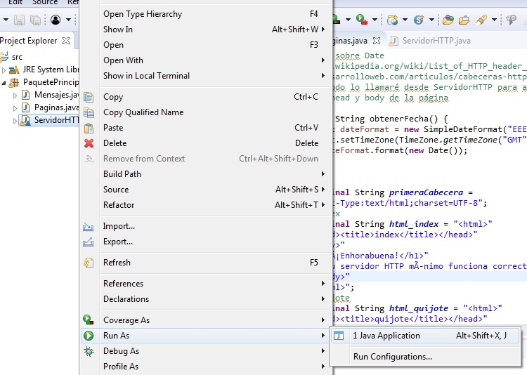
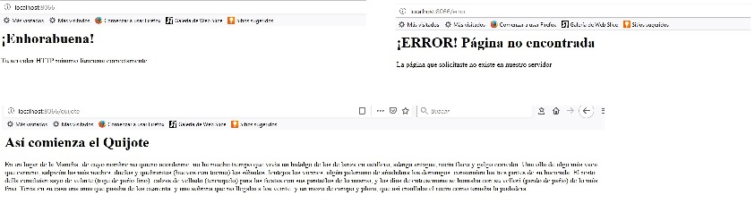

# Envío de cabecera Date
Incorporada cabecera Date a las páginas devueltas por un servidor

## Instalación 
Importar proyecto en IDE de Java

Eclipse:

Netbeans:  

## Ejemplo de uso   
Ejecutar ServidorHTTP como aplicación de java y abrir las 3 páginas en el navegador: 
  
  

## Visualización de cabeceras  
Pulsando F12 en el navegador, recargando la página y posteriormente  en la pestaña de red podemos ver las cabeceras que se han enviado:
  

## Configuración de desarrollo
Requiere instalación de Java 8, y de un navegador web. 

## META
Noelia  ue57656@edu.xunta.es
Distributed under the CreativeCommons by-nc license. See https://creativecommons.org/licenses/by-nc/2.0/es/  for more information.
