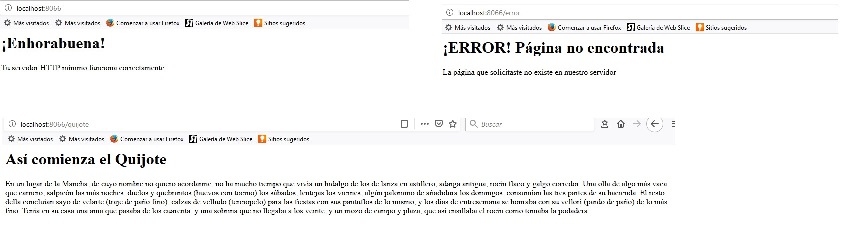

# Implementación concurrencia
Implementación concurrencia al proyecto inicial

## Instalación 
Importar proyecto en IDE de Java

Eclipse:

Netbeans:  

## Ejemplo de uso   
Ejecutar ServidorHTTP como aplicación de java
   
Acceso desde varias pestañas a la aplicación
  

## Configuración de desarrollo
Requiere instalación de Java 8 y navegador web.

## META
Noelia  ue57656@edu.xunta.es
Distributed under the CreativeCommons by-nc license. See https://creativecommons.org/licenses/by-nc/2.0/es/  for more information.
